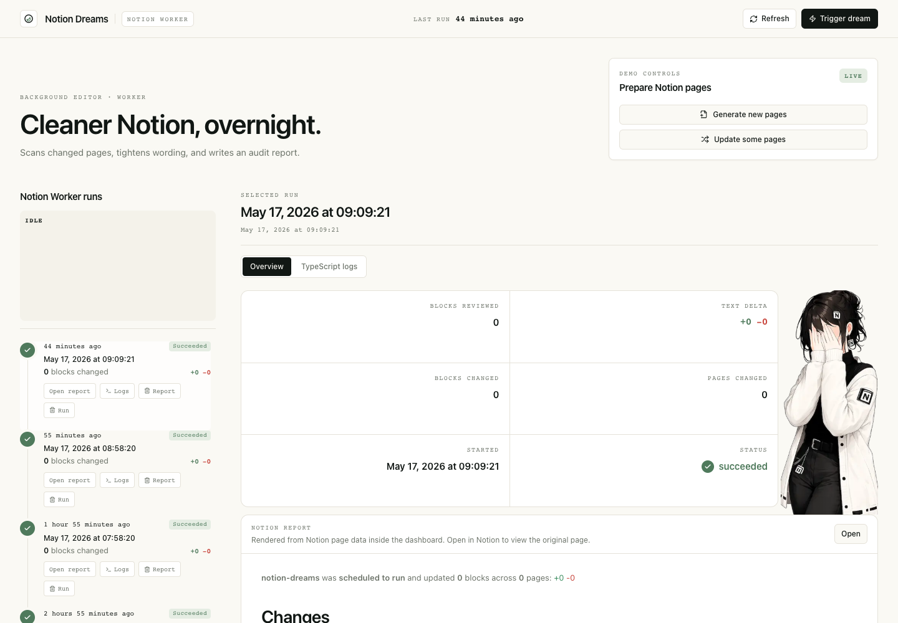

# Notion Dreams

Notion Dreams is a Notion Worker that reviews recently changed Notion pages, lightly improves wording while preserving structure, and gives the user a dashboard for inspecting runs, reports, and worker logs.



## Why

> "Writing is nature's way of letting you know how sloppy your thinking is." - Dick Guindon

Teams put important plans, updates, and decisions in Notion, but those pages often collect filler, hedging, and half-polished notes. Cleaning them up by hand is tedious, and aggressive rewriting risks changing meaning. Notion Dreams runs in the background and makes small, reviewable wording improvements so shared docs stay clearer without losing the author's intent.

## How It Works

- **Notion Workers** run the Dreams worker on demand or by trigger.
- **Notion page scanning** finds pages changed since the previous run.
- **OpenAI** rewrites eligible text blocks with conservative wording improvements.
- **Local cleanup fallback** removes common filler when no OpenAI key is available.
- **Notion API writes** update only changed editable text blocks and preserve page structure.
- **Dreams reports** are created as human-readable Notion pages under the reports page.
- **Notion `dreams-db`** stores run rows used by the dashboard run history.
- **Next.js on Vercel** gives the user a dashboard for run history, report previews, deletion actions, and TypeScript worker logs.

## Environment

Configure the worker in `worker/.env` and the dashboard in `web/.env.local`.

```bash
NOTION_API_TOKEN=
OPENAI_API_KEY=
DREAMS_NOTION_API_TOKEN=
DREAMS_OPENAI_API_KEY=
DREAMS_TARGET_PAGE_ID=363b1733-c74c-8187-9494-ee79e0a049e2
DREAMS_REPORTS_PAGE_ID=363b1733-c74c-81c8-8fd7-c3fe0a4c651d
DREAMS_REPORT_DATA_SOURCE_ID=4d1c46de-cb92-4795-b6fe-27ef13a45491
DREAMS_DRY_RUN=false
DREAMS_MAX_BLOCKS=40
DREAMS_MIN_TEXT_LENGTH=60
DREAMS_REPORT_TIME_ZONE=America/Los_Angeles
NOTION_DREAMS_DATA_SOURCE_ID=4d1c46de-cb92-4795-b6fe-27ef13a45491
```

## Local Setup

Install the worker:

```bash
cd worker
npm install
npm run check
npm run build
```

Install the dashboard:

```bash
cd web
npm install
npm run build
npm run dev -- --port 3000
```

Open `http://localhost:3000`.

## Notion Worker

Install and log in to the Notion CLI:

```bash
curl -fsSL https://ntn.dev | NTN_INSTALL_DIR="$HOME/.local/bin" bash
$HOME/.local/bin/ntn login
```

Deploy the worker:

```bash
cd worker
$HOME/.local/bin/ntn workers deploy --local-build
```

Trigger a manual demo run:

```bash
cd worker
$HOME/.local/bin/ntn workers sync trigger notionDreams
```

Inspect worker runs and logs:

```bash
$HOME/.local/bin/ntn workers runs list
$HOME/.local/bin/ntn workers runs logs <run_id>
```

## Dashboard

The dashboard reads visible run history only from Notion `dreams-db`. It does not merge raw `ntn workers runs` rows into the run list.

```bash
cd web
npm run dev -- --port 3000
```

The Logs tab calls `/api/run-logs`, shells out to the Notion CLI, and matches the selected `dreams-db` row by timestamp.

## Vercel

Set these Vercel environment variables:

```bash
NOTION_API_TOKEN
NOTION_DREAMS_DATA_SOURCE_ID
```

Deploy the dashboard only when needed:

```bash
cd web
npm run deploy:vercel
```
