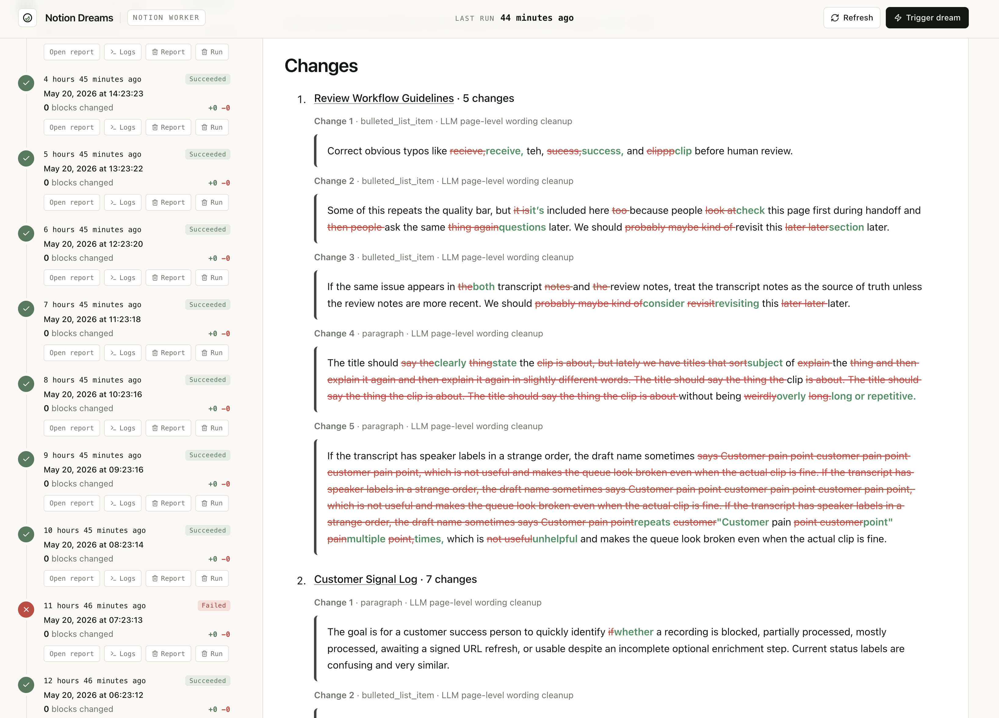

# Notion Dreams

Notion Dreams is a Notion Worker that reviews recently changed Notion pages, lightly improves wording while preserving structure, and gives the user a dashboard for inspecting runs, reports, and worker logs.

<table>
  <tr>
    <td width="50%"></td>
    <td width="50%"></td>
  </tr>
</table>

## Why

Claude recently launched [dreaming in Claude Managed Agents](https://x.com/claudeai/status/2052067399088664981?s=20), a research preview where agents review past sessions, extract patterns, and curate memories over time. Notion Dreams applies a similar idea to Notion workspaces: it scans recently changed pages, tightens wording while preserving meaning and structure, and writes an audit report for every run. The dashboard lets users inspect runs, reports, and worker logs so teams can wake up to cleaner, clearer docs.

## Hackathon

Notion Dreams was built as part of the [Notion Developer Platform Hackathon](https://cerebralvalley.ai/events/~/e/notion-developer-platform-hackathon), held May 16-17, 2026 at Notion HQ in San Francisco. The event had 49 submitted projects in the [project gallery](https://cerebralvalley.ai/events/~/e/notion-developer-platform-hackathon/hackathon/gallery) and 288 registered attendees. The project received positive feedback from judges at Anthropic and Notion, though it was not selected as one of the top 6 projects invited to present on stage. Watch the [hackathon submission demo](https://www.youtube.com/watch?v=hMv3Az-qzG8).

## How It Works

- **Notion Workers** run the Dreams worker on demand or by trigger.
- **Notion page scanning** finds pages changed since the previous run.
- **OpenAI** rewrites eligible text blocks with conservative wording improvements.
- **Local cleanup fallback** removes common filler when no OpenAI key is available.
- **Notion API writes** update only changed editable text blocks and preserve page structure.
- **Dreams reports** are created as human-readable Notion pages under the reports page.
- **Notion `dreams-db`** stores run rows used by the dashboard run history.
- **Next.js on Vercel** gives the user a dashboard for run history, report previews, deletion actions, and TypeScript worker logs.
